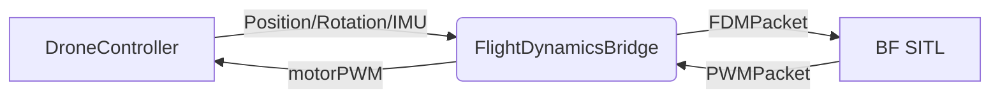

# Architektur-Plan: Erster Flug

## 1. Prefab-Spezifikation

### GameObject-Hierarchie
```plaintext
DronePrefab (Rigidbody, DroneController, BoxCollider)
├── FrontLeft (Empty, Motor Position)
├── FrontRight (Empty, Motor Position)
├── BackLeft (Empty, Motor Position)
├── BackRight (Empty, Motor Position)
├── FPVCamera (Camera, FPVCamera)
└── PlaceholderMesh (Root für visuelles Mesh)
    ├── Center (Cube)
    ├── FrontArm (Cube)
    ├── BackArm (Cube)
    ├── RightArm (Cube)
    ├── LeftArm (Cube)
    ├── FL_Motor (Sphere)
    ├── FR_Motor (Sphere)
    ├── BL_Motor (Sphere)
    └── BR_Motor (Sphere)
```

### Komponenten und Objekte
- **Main GameObject:** `DronePrefab`
  - `Rigidbody` (automatisch von DroneController)
  - `DroneController`
  - `BoxCollider` (Größe: 0.3 × 0.05 × 0.3m, Quad-Rahmen)
- **Leere Transforms für Motoren:** Definieren Motorpositionen relativ zum Zentrum
- **FPVCamera:** Kamera mit RT-Output für FPV-Anzeige
- **PlaceholderMesh:** Visuelles Gerüst zur In-Editor-Ansicht

### Zu erstellende ScriptableObjects
1. **`DroneConfig`** - Einstellungen für Physik und Motoren
2. **`BridgeConfig`** - Netzwerkeinstellungen für BF SITL-Kommunikation
3. **`ControllerConfig`** - Mapping von Gamepad-Achsen auf RC-Kanäle

### Default-Werte der Configs

#### DroneConfig
- `mass`: 0.5 kg
- `maxThrustPerMotor`: 4.0 N
- `armLength`: 0.12 m
- `dragCoefficient`: 0.1
- `angularDragCoefficient`: 0.5

#### BridgeConfig
- `bfSITLIPAddress`: 127.0.0.1
- `fdmSendPort`: 9002
- `pwmReceivePort`: 9003
- `updateFrequency`: 400 Hz

#### ControllerConfig
- `bfSITLIPAddress`: 127.0.0.1
- `rcPort`: 9004
- `sendRateHz`: 100
- `roll.rcChannel`: 0, `invert`: false, `deadzone`: 0.05, `expo`: 0.0
- `pitch.rcChannel`: 1, `invert`: false, `deadzone`: 0.05, `expo`: 0.0
- `throttle.rcChannel`: 2, `invert`: false, `deadzone`: 0.02, `expo`: 0.0
- `yaw.rcChannel`: 3, `invert`: false, `deadzone`: 0.05, `expo`: 0.0
- `auxMappings`: 4 Buttons auf Kanäle 4–7 (A/B/X/Y → 1000/2000 Toggle)

## 2. Bridge-Verbindung

### Kommunikation mit BF SITL
- **FDM → BF SITL (Unity → SITL)**
  - UDP Port: `9002`
  - Paket: `FDMPacket` mit Position, Rotation, Geschwindigkeit, Beschleunigung, Druck
  - Frequenz: 400 Hz (`BridgeConfig.updateFrequency`)
- **PWM ← BF SITL (SITL → Unity)**
  - UDP Port: `9003`
  - Paket: `PWMPacket` mit 4 Motor-PWM-Werten (0.0–1.0)
  - Verarbeitung in `ProcessReceivedPWMPackets()` auf Main-Thread

### Datenfluss


### Referenzen im Inspector
- `FlightDynamicsBridge`
  - `config`: Verweis auf `BridgeConfig`-Asset
  - `droneController`: Verweis auf `DroneController`-Komponente des Drohnen-Prefabs
- `DroneController`
  - `config`: Verweis auf `DroneConfig`-Asset

Zusätzlich wird `RCInputBridge` benötigt, um RC-Eingaben an BF SITL zu senden.

## 3. SITL Integration

### Starten von BF SITL
- Nutze bestehendes Skript: `tools/start_sitl.sh`
- Erwartet, dass BF SITL Binary unter `betaflight/obj/main/betaflight_SITL.elf` liegt
- Startet SITL mit korrekten Ports (9001–9004)

### Arming des SITL
- Methode: **über Betaflight Configurator (empfohlen)**
  - Verbindung via TCP-Port `5761`
  - Im GUI: Arming-Switch aktivieren (oder per MSP-Cmd)
- Alternative: CLI-Befehl im SITL-Terminal:
  ```
  arm
  ```
- **Voraussetzung:** Throttle = 0, Yaw = min, FlightMode = Angle/Horizon (nicht benötigt)

### Fehlerbehandlung
- **SITL nicht erreichbar:**
  - `FlightDynamicsBridge` zeigt `IsConnected = false`
  - Debug-Log: "FDM sender connected to..." fehlt
  - Fallback: Prüfe, ob `tools/start_sitl.sh` läuft
- **Keine PWM-Pakete empfangen:**
  - Nach 2 Sekunden Timeout: `IsConnected = false`
  - Mögliche Ursache: SITL nicht armiert
- **RCInputBridge Send-Fehler:**
  - Rate-limited auf 1 Warnung alle 5s
  - Hinweis: "BF SITL not running?"
- **Editor-Workflow:**
  1. `tools/start_sitl.sh` starten
  2. In Unity `Welle1Test.unity` laden
  3. DronePrefab einfügen und verbinden
  4. Configurator öffnen → verbinden (TCP 5761) → armen
  5. In Unity Play drücken

## 4. SkyForgeIntegrator.cs Spezifikation

### Anforderungen
- MenuItem: `SkyForge/Setup Drone in Scene`
- Automatisiert:
  - Erstellt Drone-Prefab in aktiver Scene
  - Erzeugt alle benötigten Config-Assets mit Defaults
  - Platziert und verbindet `FlightDynamicsBridge`
  - Startet `RCInputBridge`

### Code-Spezifikation
```csharp
#if UNITY_EDITOR
using UnityEngine;
using UnityEditor;

public class SkyForgeIntegrator
{
    [MenuItem("SkyForge/Setup Drone in Scene")]
    public static void SetupDroneInScene()
    {
        // 1. Prefab instanziieren (oder neu erstellen)
        GameObject dronePrefab = CreateDronePrefab();
        if (dronePrefab == null) return;

        // 2. Configs erstellen
        DroneConfig droneConfig = CreateOrFindAsset<DroneConfig>("Assets/Configs/DroneConfig.asset");
        BridgeConfig bridgeConfig = CreateOrFindAsset<BridgeConfig>("Assets/Configs/BridgeConfig.asset");
        ControllerConfig controllerConfig = CreateOrFindAsset<ControllerConfig>("Assets/Configs/ControllerConfig.asset");

        // 3. Defaults setzen
        ApplyDefaultDroneConfig(droneConfig);
        ApplyDefaultBridgeConfig(bridgeConfig);
        ApplyDefaultControllerConfig(controllerConfig);

        // 4. Komponenten verbinden
        DroneController droneController = dronePrefab.GetComponent<DroneController>();
        droneController.config = droneConfig;

        FlightDynamicsBridge bridge = Object.FindObjectOfType<FlightDynamicsBridge>();
        if (bridge == null)
        {
            GameObject bridgeObj = new GameObject("FlightDynamicsBridge");
            bridge = bridgeObj.AddComponent<FlightDynamicsBridge>();
        }
        bridge.config = bridgeConfig;
        bridge.droneController = droneController;

        // 5. RCInputBridge sicherstellen
        RCInputBridge rcInput = Object.FindObjectOfType<RCInputBridge>();
        if (rcInput == null)
        {
            GameObject rcObj = new GameObject("RCInputBridge");
            rcInput = rcObj.AddComponent<RCInputBridge>();
        }
        rcInput.config = controllerConfig;

        // 6. Scene speichern (optional)
        EditorUtility.SetDirty(dronePrefab);
        AssetDatabase.SaveAssets();
        Debug.Log("[SkyForgeIntegrator] Drone setup complete!");
    }

    static GameObject CreateDronePrefab()
    {
        // Nutze DroneSetup zum Erstellen
        GameObject drone = new GameObject("Drone");
        drone.AddComponent<DroneController>();
        DroneSetup.SetupDronePrefab(drone);
        return drone;
    }

    static T CreateOrFindAsset<T>(string path) where T : ScriptableObject
    {
        T asset = AssetDatabase.LoadAssetAtPath<T>(path);
        if (asset == null)
        {
            asset = ScriptableObject.CreateInstance<T>();
            string dir = System.IO.Path.GetDirectoryName(path);
            if (!System.IO.Directory.Exists(dir))
                System.IO.Directory.CreateDirectory(dir);
            AssetDatabase.CreateAsset(asset, path);
        }
        return asset;
    }

    static void ApplyDefaultDroneConfig(DroneConfig config)
    {
        config.mass = 0.5f;
        config.maxThrustPerMotor = 4.0f;
        config.armLength = 0.12f;
        config.dragCoefficient = 0.1f;
        config.angularDragCoefficient = 0.5f;
        EditorUtility.SetDirty(config);
    }

    static void ApplyDefaultBridgeConfig(BridgeConfig config)
    {
        config.bfSITLIPAddress = "127.0.0.1";
        config.fdmSendPort = 9002;
        config.pwmReceivePort = 9003;
        config.updateFrequency = 400;
        EditorUtility.SetDirty(config);
    }

    static void ApplyDefaultControllerConfig(ControllerConfig config)
    {
        config.bfSITLIPAddress = "127.0.0.1";
        config.rcPort = 9004;
        config.sendRateHz = 100;
        config.roll.rcChannel = 0; config.roll.invert = false; config.roll.deadzone = 0.05f; config.roll.expo = 0;
        config.pitch.rcChannel = 1; config.pitch.invert = false; config.pitch.deadzone = 0.05f; config.pitch.expo = 0;
        config.throttle.rcChannel = 2; config.throttle.invert = false; config.throttle.deadzone = 0.02f; config.throttle.expo = 0;
        config.yaw.rcChannel = 3; config.yaw.invert = false; config.yaw.deadzone = 0.05f; config.yaw.expo = 0;
        EditorUtility.SetDirty(config);
    }
}
#endif
```

## 5. Testplan

### Vorbereitung
- Stelle sicher, dass `tools/start_sitl.sh` existiert und ausführbar ist
- Verifiziere, dass BF SITL Binary kompiliert ist unter `betaflight/obj/main/betaflight_SITL.elf`
- Öffne Szene `Welle1Test.unity`

### Schritt 1: SITL starten
- Terminal ausführen: `tools/start_sitl.sh`
- Erwartung: SITL startet mit UDP-Ports 9001–9004 offen

### Schritt 2: Verbindung herstellen
- Starte `SkyForgeIntegrator` via MenuItem
- Überprüfe in Hierarchy:
  - `Drone` existiert mit Komponenten
  - `FlightDynamicsBridge` existiert und hat Referenzen
  - `RCInputBridge` existiert und hat ControllerConfig
- In der Inspector: `IsConnected = true`

### Schritt 3: Arming
- Öffne Betaflight Configurator
- Verbinde via TCP zu `127.0.0.1:5761`
- Stelle sicher, dass Throttle auf Minimum
- Aktiviere Arming-Schalter im GUI (oder `arm` im CLI)

### Schritt 4: Erster Flug
- In Unity: „Play“ drücken
- Steuere TX16S:
  - Leichtes Hochziehen des Gashebels (Throttle)
  - Erwartung: Drohne hebt ab, stabiles Schweben
  - Prüfung der Achsen: Roll, Pitch, Yaw reagieren korrekt
- FDM-Pakete und PWM-Pakete sollten kontinuierlich zählen

### Schritt 5: Fehlerfälle testen
- Stoppe SITL → prüfe, ob `IsConnected = false` wird
- Arming deaktivieren → prüfe, ob Motoren auf 0 gehen
- Trenne Controller → prüfe, ob Kanäle auf Neutral gehen

### Abnahme-Kriterium
G1 — Build: Unity compiliert ohne Fehler
G3 — Integration: BF SITL empfängt FDM-Packets und sendet PWM-Packets
G5 — Fly: Drohne schwebt stabil im Luftstrom (<0.5m Abweichung)

Nach Bestehen aller Tests: Quality Gate 3 (Integration) und 5 (Fly) bestanden.